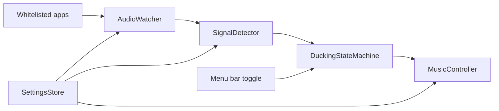

# Architecture

## Product Shape

FlowSound should be a native macOS menu bar app. It should run quietly in the background, expose a compact status menu, and keep all automation reversible.

## Components

### MenuBarApp

Owns the app lifecycle and user-facing status.

Responsibilities:

- Start and stop the service.
- Show current state and permission errors.
- Open settings when settings are added.
- Trigger manual recovery actions if Music control fails.

### AudioWatcher

Owns Core Audio process taps and audio activity detection.

Responsibilities:

- Resolve whitelist entries to running processes or bundle identifiers.
- Create and destroy process taps.
- Read captured audio buffers.
- Emit debounced activity events: audible, quiet, unavailable, permission denied.

### SignalDetector

Converts raw audio buffers into stable activity decisions.

Responsibilities:

- Compute RMS or peak level.
- Apply threshold and minimum active duration.
- Apply quiet duration before restore.
- Avoid sending duplicate state changes.

### MusicController

Controls Apple Music through a narrow automation adapter.

Responsibilities:

- Read and store Music volume before FlowSound changes it.
- Fade volume down and up.
- Pause and play Music.
- Report automation failures without hiding them.

### DuckingStateMachine

Coordinates the product behavior.

Initial states:

- `disabled`
- `listening`
- `ducking`
- `pausedByFlowSound`
- `restoring`
- `permissionBlocked`
- `error`

Important rules:

- Resume only when FlowSound paused Music.
- Cancel restore if watched audio becomes active again.
- Cancel fade-in or fade-out when service is disabled.
- Never overwrite the user's volume target after FlowSound has started restoring.

### SettingsStore

Persists local configuration.

Initial settings:

- Enabled flag.
- Whitelisted bundle identifiers.
- Active threshold.
- Active duration.
- Quiet duration.
- Fade-out duration.
- Fade-in duration.

## Default Configuration

- Whitelist: Safari and Telegram.
- Active duration: 0.5 seconds.
- Quiet duration: 5 seconds.
- Fade-out duration: 3 seconds.
- Fade-in duration: 3 seconds.

## Data Flow

## Design Decisions

- Use Core Audio process taps instead of microphone input so FlowSound detects app output, not room sound.
- Use AppleScript as a small adapter instead of ScriptingBridge-heavy integration.
- Keep the first version local-only with no network service.
- Treat permission failures as first-class app states.
