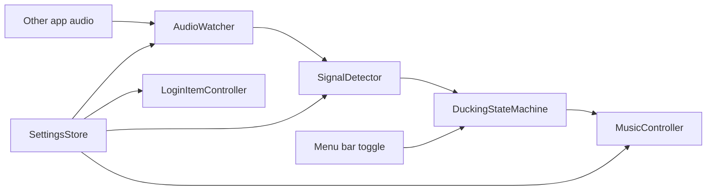

# Architecture

## Product Shape

FlowSound is a native macOS menu bar app. It runs quietly in the background, exposes a compact status menu, and keeps automation reversible.

## Components

### MenuBarApp

Owns the app lifecycle and user-facing status.

Responsibilities:

- Start and stop the service.
- Show current state and permission errors.
- Open settings.
- Trigger manual recovery actions if Music control fails.
- Open diagnostics manually from the menu bar menu.
- Start the service activated by default on launch.
- Swap the menu bar icon when the service is activated or deactivated.

### Diagnostics

Writes local startup and status item events to `~/Library/Logs/FlowSound/FlowSound.log`.

The log is intentionally simple and local-only. It exists because macOS menu bar apps can otherwise fail invisibly: no Dock icon, no main window, and no terminal output when launched through Finder.

### AudioWatcher

Owns audio activity detection. The current implementation uses `CoreAudioProcessTapMonitor` for bundle ID-based process taps and keeps manual simulation methods for debugging.

Responsibilities:

- Create and destroy Core Audio process taps.
- Recreate taps when the watched app whitelist changes.
- Support all-apps monitoring by excluding Apple Music and FlowSound from an exclusive process tap.
- Wrap the tap in a private aggregate device and start an IO proc.
- Read captured audio buffers.
- Compute RMS level from the captured PCM buffers.
- Poll matching Core Audio process objects for active output IO as a fallback signal.
- Emit debounced activity events: audible, quiet, unavailable, permission denied.

### SignalDetector

Converts raw audio buffers into stable activity decisions.

Responsibilities:

- Compute RMS or peak level.
- Apply threshold and minimum active duration.
- Keep the active candidate through short low-RMS gaps.
- Apply quiet duration before restore.
- Use a short timer to release active state after recent audible buffers stop.
- Keep process-output polling diagnostic-only in all-apps mode to avoid stale process state stretching quiet detection.
- Avoid sending duplicate state changes.

### MusicController

Controls Apple Music through a narrow automation adapter. The current implementation uses `osascript` to run short AppleScript commands.

Responsibilities:

- Read and store Music volume before FlowSound changes it.
- Read Music playback state before ducking.
- Fade volume down and up.
- Pause and play Music.
- Report automation failures without hiding them.

### DuckingStateMachine

Coordinates the product behavior.

Initial states:

- `disabled`
- `listening`
- `ducking`
- `pausedByFlowSound`
- `restoring`
- `permissionBlocked`
- `error`

Important rules:

- Resume only when FlowSound paused Music.
- Skip ducking when Music is paused or stopped before watched audio starts.
- Cancel restore if watched audio becomes active again.
- Cancel fade-in or fade-out when service is disabled.
- Never overwrite the user's captured restore volume during interrupted duck/restore cycles.

### SettingsStore

Persists local configuration.

Initial settings:

- Enabled flag.
- Audio monitoring mode.
- Excluded bundle identifiers for all-apps monitoring mode.
- User-editable whitelisted bundle identifiers.
- Active threshold.
- Active duration.
- Quiet duration.
- Fade-out duration.
- Fade-in duration.
- Menu bar text visibility.

Settings are stored in `UserDefaults` through `FlowSoundSettingsStore`. Updates are applied to the menu bar presentation immediately and forwarded to `FlowSoundService`.

Audio monitoring mode is persisted in `UserDefaults`. The default mode monitors all app audio except Apple Music, FlowSound, and common macOS notification services. Watched-app-only mode uses the user-editable bundle identifier list.

Watched bundle identifiers are parsed from Preferences, validated, deduplicated, and persisted. If the saved whitelist is empty or invalid, FlowSound falls back to the default Safari and Telegram identifiers.

Safari is expanded at runtime to include WebKit helper bundle identifiers because website audio, including YouTube playback, may be emitted by helper processes rather than the `com.apple.Safari` process itself.

### LoginItemController

Controls launch-at-login using `SMAppService.mainApp`.

Responsibilities:

- Read the current login item status.
- Register FlowSound from `notRegistered` or `notFound` states.
- Unregister FlowSound from `enabled` or `requiresApproval` states.
- Avoid repeated registration while macOS is waiting for login item approval.
- Avoid touching the login item when Preferences is saved without changing the checkbox.
- Open System Settings > Login Items when user approval is needed.

Local debug builds may report `notFound` before registration. FlowSound attempts registration instead of treating that status as an app-level unavailable state, but release validation should still use a signed and installed app.

### LogoAssets

Generated by `scripts/generate-logo-assets.swift` from `FlowSound-iCon.png` and `FlowSound-Deactivate-iCon.png`.

Outputs:

- `Assets/FlowSoundLogoDarkBackground.png`
- `Assets/FlowSoundLogoLightBackground.png`
- `Assets/FlowSoundMenuBarTemplate.png`
- `Assets/FlowSoundMenuBarActiveTemplate.png`
- `Assets/FlowSoundMenuBarInactiveTemplate.png`
- `Assets/FlowSoundDeactivateLightBackground.png`
- `Assets/FlowSoundDeactivateDarkBackground.png`
- `Assets/FlowSound.icns`

The menu bar icon uses transparent template assets so macOS can tint them for light and dark menu bars.

The app bundle icon uses the generated `.icns` file declared through `CFBundleIconFile`.

### Release Packaging

`scripts/package-release.sh` builds a release app bundle, optionally signs and notarizes it, packages it as a zip archive, and writes a SHA-256 checksum file.

Release packaging responsibilities:

- Use `scripts/build-app.sh release` as the app bundle source.
- Keep unsigned development archives possible for testers.
- Use Developer ID signing and notarization when release credentials are available.
- Publish `FlowSound-<version>.zip` and `SHA256SUMS.txt`.
- Keep release notes explicit about macOS 26+, Apple Music-only behavior, and required permissions.

## Default Configuration

- Monitoring mode: all apps except Apple Music.
- Excluded bundle identifiers: Apple Music, FlowSound, and common macOS notification services.
- Watched-app-only fallback whitelist: Safari and Telegram.
- Active duration: 1 second.
- Quiet duration: 3 seconds.
- Fade-out duration: 2 seconds.
- Fade-in duration: 2 seconds.

## Data Flow

## Design Decisions

- Use Core Audio process taps instead of microphone input so FlowSound detects app output, not room sound. The codebase currently keeps this behind `AudioActivityMonitor`.
- Use all-apps-except-Music monitoring by default to avoid per-app bundle identifier friction.
- Use an excluded bundle identifier list to filter Apple Music, FlowSound, and common notification services from all-apps monitoring.
- Use Core Audio process-output polling as a fallback activity source when a matching process is actively outputting audio.
- Use AppleScript as a small adapter instead of ScriptingBridge-heavy integration.
- Keep the first version local-only with no network service.
- Treat permission failures as first-class app states.
